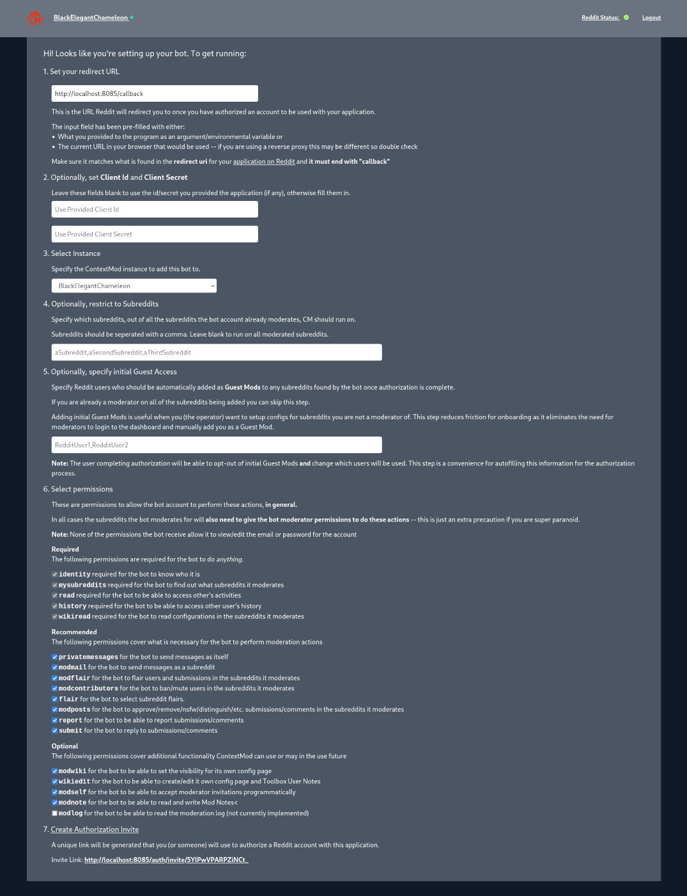
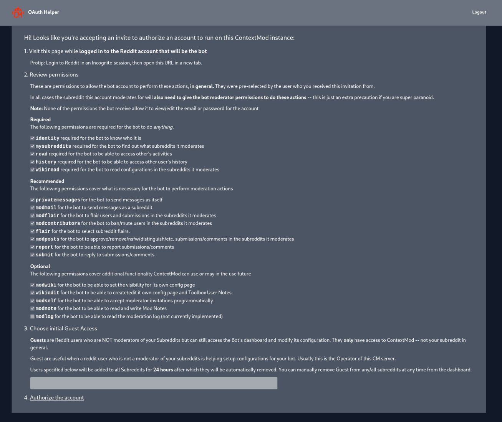

# ContextMod   

[**Context Mod**](https://contextmod.dev/) (CM) is an event-based, [reddit](https://reddit.com) moderation bot built on top of [snoowrap](https://github.com/not-an-aardvark/snoowrap) and written in [typescript](https://www.typescriptlang.org/).

It is designed to help fill in the gaps for [automoderator](https://www.reddit.com/wiki/automoderator/full-documentation) in regard to more complex behavior with a focus on **user-history based moderation.**

An example of the above that Context Bot can do:

> * On a new submission, check if the user has also posted the same link in **N** number of other subreddits within a timeframe/# of posts
> * On a new submission or comment, check if the user has had any activity (sub/comment) in **N** set of subreddits within a timeframe/# of posts
>
>In either instance Context Bot can then perform any action a moderator can (comment, report, remove, lock, etc...) against that user, comment, or submission.

Feature Highlights for **Moderators:**

* Complete bot **autonomy**. YAML config is [stored in your subreddit's wiki](moderators/gettingStarted.md#setup-wiki-page) (like automoderator)
* Simple rule-action behavior can be combined to create **complex behavior detection**
* Support Activity filtering based on:
  * [Author criteria](subreddit-configuration/in-depth/filters/README.md#author-filter) (name, css flair/text, age, karma, moderator status, [Toolbox User Notes](https://www.reddit.com/r/toolbox/wiki/usernotes), and more!)
  * [Activity state](subreddit-configuration/in-depth/filters/README.md#item-filter) (removed, locked, distinguished, etc...)
  * State of Subreddit Activity is in [Subreddit](subreddit-configuration/in-depth/filters/README.md#subreddit-filter) (nsfw, name, profile, etc...)
* Rules and Actions support [named references](subreddit-configuration/README.md#named-rules) -- **write once, reference anywhere**
* Powerful [logic control](subreddit-configuration/advancedConcepts/flowControl.md) (if, then, goto)
* [Delay/re-process activities](subreddit-configuration/README.md#dispatch) using arbitrary rules
* [**Image Comparisons**](subreddit-configuration/imageComparison.md) via fingerprinting and/or pixel differences
* [**Repost detection**](subreddit-configuration/in-depth/repost) with support for external services (youtube, etc...)
* Event notification via Discord
* [**Web interface**](#web-ui-and-screenshots) for monitoring, administration, and oauth bot authentication
* [**Placeholders**](subreddit-configuration/actionTemplating.md) (like automoderator) can be configured via a wiki page or raw text and supports [mustache](https://mustache.github.io) templating
* [**Partial Configurations**](subreddit-configuration/README.md#partial-configurations) -- offload parts of your configuration to shared locations to consolidate logic between multiple subreddits
* [Guest Access](moderators/README.md#guest-access) enables collaboration and easier setup by allowing temporary access
* [Toxic content prediction](subreddit-configuration/README.md#moderatehatespeechcom-predictions) using [moderatehatespeech.com](https://moderatehatespeech.com) machine learning model

Feature highlights for **Developers and Hosting (Operators):**

* [Server/client architecture](operator/serverClientArchitecture.md)
  * Default/no configuration runs "All In One" behavior
  * Additional configuration allows web interface to connect to multiple servers
  * Each server instance can run multiple reddit accounts as bots
* Global/subreddit-level [**caching**](operator/caching.md) of Reddit APIs responses and CM results
* [Database Persistence](operator/database.md) using SQLite, MySql, or Postgres
  * Audit trails for bot activity
  * Historical statistics
* [Docker container](operator/installation.md#docker-recommended) and [docker-compose](operator/installation.md#docker-compose) support
* Easy, UI-based [OAuth authentication](operator/addingBot.md) for adding Bots and moderator dashboard
* Integration with [InfluxDB](https://www.influxdata.com) for detailed [time-series metrics](operator/database.md#influx) and a pre-built [Grafana](https://grafana.com) [dashboard](operator/database.md#grafana)

# Table of Contents

* [How It Works](#how-it-works)
* [Getting Started](#getting-started)
* [Configuration And Documentation](#configuration-and-documentation)
* [Web UI and Screenshots](#web-ui-and-screenshots)

### How It Works

Each subreddit using the RCB bot configures its behavior via their own wiki page. 

When a monitored **Activity** (new comment/submission, new modqueue item, etc.) is detected the bot runs through a list of [**Checks**](subreddit-configuration/README.md#checks) to determine what to do with the **Activity** from that Event. Each **Check** consists of :

#### Kind

Is this check for a submission or comment?

#### Rules

A list of [**Rules**](subreddit-configuration/README.md#rules) to run against the **Activity**. Triggered Rules can cause the whole Check to trigger and run its **Actions**

#### Actions

A list of [**Actions**](subreddit-configuration/README.md#actions) that describe what the bot should do with the **Activity** or **Author** of the activity (comment, remove, approve, etc.). The bot will run **all** Actions in this list.

___

The **Checks** for a subreddit are split up into **Submission Checks** and **Comment Checks** based on their **kind**. Each list of checks is run independently based on when events happen (submission or comment).

When an Event occurs all Checks of that type are run in the order they were listed in the configuration. When one check is triggered (an Action is performed) the remaining checks will not be run.

___

[Learn more about the RCB lifecycle and core concepts in the docs.](/README.md#how-it-works)

## Getting Started

#### Operators

This guide is for users who want to **run their own bot on a ContextMod instance.**

See the [Operator's Getting Started Guide](operator/gettingStarted.md)

#### Moderators

This guide is for **reddit moderators** who want to configure an existing CM bot to run on their subreddit.

See the [Moderator's Getting Started Guide](moderators/gettingStarted.md)

## Configuration and Documentation

Context Bot's configuration can be written in YAML (like automoderator) or [JSON5](https://json5.org/). Its schema conforms to [JSON Schema Draft 7](https://json-schema.org/). Additionally, many **operator** settings can be passed via command line or environmental variables.

* For **operators** (running the bot instance) see the [Operator Configuration](operator/configuration.md) guide
* For **moderators** consult the [Subreddit Configuration Docs](subreddit-configuration/README.md)

[**Check the full docs for in-depth explanations of all concepts and examples**](/docs)

## Web UI and Screenshots

### Dashboard

CM comes equipped with a dashboard designed for use by both moderators and bot operators.

* Authentication via Reddit OAuth -- only accessible if you are the bot operator or a moderator of a subreddit the bot moderates
* Connect to multiple ContextMod instances (specified in configuration)
* Monitor API usage/rates
* Monitoring and administration **per subreddit:**
  * Start/stop/pause various bot components
  * View statistics on bot usage (# of events, checks run, actions performed) and cache usage
  * View various parts of your subreddit's configuration and manually update configuration
  * View **real-time logs** of what the bot is doing on your subreddit
  * **Run bot on any permalink**

### Bot Setup/Authentication

A bot oauth helper allows operators to define oauth credentials/permissions and then generate unique, one-time invite links that allow moderators to authenticate their own bots without operator assistance. [Learn more about using the oauth helper.](operator/addingBot.md#cm-oauth-helper-recommended)

Operator view/invite link generation:

Moderator view/invite and authorization:

A similar helper and invitation experience is available for adding **subreddits to an existing bot.**

### Configuration Editor

A built-in editor using [monaco-editor](https://microsoft.github.io/monaco-editor/) makes editing configurations easy:

* Automatic JSON or YAML syntax validation and formatting
* Automatic Schema (subreddit or operator) validation
* All properties are annotated via hover popups
* Unauthenticated view via `yourdomain.com/config`
* Authenticated view loads subreddit configurations by simple link found on the subreddit dashboard
* Switch schemas to edit either subreddit or operator configurations

### [Grafana Dashboard](operator/database.md#grafana)

* Overall stats (active bots/subreddits, api calls, per second/hour/minute activity ingest)
* Over time graphs for events, per subreddit, and for individual rules/check/actions

## License

[MIT](/LICENSE)
