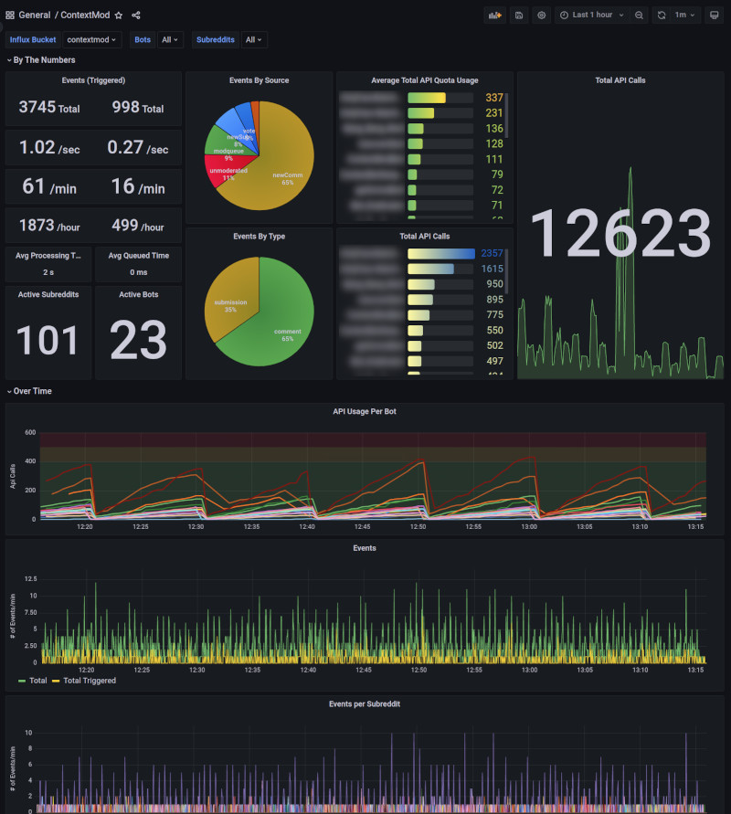

# Database

# Overview

CM uses a database to store three types of data:

* **Recorded Events** -- an "audit" of how CM processed an Activity (Comment/Submission) and what actions it took based on the result of processing it (comment, report, remove, etc.)
* Persistent Settings/Data
  * Settings like the last known state of a Subreddit's bot before the application exited
  * Web Client sessions and invites -- stuff that should survive a restart
* Statistics
  * All-time and time-series high-level statistics like # of events, # of checks run, etc...

CM does NOT store subreddit configurations or any runtime alterations of these configurations. This is to keep configurations **portable** -- on principle, if you (a moderator) choose to use a different CM instance to run your subreddit's bot then it should not function differently.

# Providers

CM uses [TypeORM](https://typeorm.io/) as the database access layer and specifically supports three database types:

* SQLite -- using either [SQL.js](https://sql.js.org) or native SQLite through [better-sqlite3](https://github.com/JoshuaWise/better-sqlite3)
* MySQL/MariaDB
* Postgres

The database configuration is specified in the top-level `databaseConfig.connection` property in the operator configuration. EX:

```yaml
operator:
  name: u/MyRedditAccount
databaseConfig:
  connection:
   ...
```

## SQLite

When using a [local installation](installation.md#locally) the default database is `sqljs`, which requires no binary dependencies. When using [docker](installation.md#docker-recommended) the default is `better-sqlite3`.

**NOTE:** It is **NOT RECOMMENDED** to use `sqljs` in a production environment for performance reasons. You should at least switch to `better-sqlite3` or preferably MySql/Postgres.

* [`sqljs` connection options](https://typeorm.io/data-source-options#sqljs-data-source-options)
* [`better-sqlite3` connection options](https://typeorm.io/data-source-options#better-sqlite3-data-source-options)

For both sqlite types, if no database/location is specified, it will be created in the [`DATA_DIR` directory.](configuration.md#specify-file-location)

If CM detects it cannot **read and write** to the database files, or directory if no files exist, it will fallback to using an in-memory database that will be lost when CM restarts. If you have trouble with r/w permissions and are using docker make sure [file permissions are correct for your mounted volume.](installation.md#linux-host)

## MySQL/MariaDB

[MySQL/MariaDB connection options](https://typeorm.io/data-source-options#mysql--mariadb-data-source-options)

The `database` you specify should exist before using CM.

## Postgres

[Postgres connection options](https://typeorm.io/data-source-options#postgres--cockroachdb-data-source-options)

The `database` and `schema` you specify should exist before using CM.

# Migrations

CM implements database migrations. On startup it will check for any pending migrations. If the database doesn't exist (sqlite) or is empty or no tables conflict it will automatically execute migrations.

If there is any kind of conflict it will **pause startup** and display a prompt in the user interface to confirm migration execution. **You should always backup your database before running migrations.**

To force CM to always run migrations without confirmation set `force` to `true` in the `migrations` property within `databaseConfig`:

```yaml
databaseConfig:
  migrations:
    force: true # always run migrations
```

### SQLite

When using a SQLite driver CM can create automatic backups for you. Another prompt will be displayed on the migrations page in the web interface to make a copy of your database. You can make CM automatically backup and continue with migrations like so:

```yaml
databaseConfig:
  migrations:
    continueOnAutomatedBackup: true # try to backup sqlite files automatically and continue with migrations if successful
```

# Recorded Event Retention

The **Recorded Events** CM stores in the database can be controlled per subreddit. By default events will be stored indefinitely.

A **Retention Policy** is a metric to determine what "range" of Recorded Events CM should keep in the database. It can be either:

* A **number** -- The last X number of Recorded Events will be kept
  * EX `1000` -> Keep the last 1000 events and discard any others.
* A **duration** -- A time period, starting from now until X `duration` in the past, for which events will be kept
  * EX `3 months` -> Keep all events created between now and 3 months ago. Anything older than 3 months ago will be discarded.

The Retention Policy can be specified at operator level, bot, subreddit *override*, and subreddit configuration level:

```yaml
operator:  
  name: u/MyRedditAccount
databaseConfig:
  retention: '3 months' # each subreddit will retain 3 months of recorded events
bots:
    # all subreddits this bot moderates will have 3 month retention
  - name: u/OneBotAccount
    credentials:
      ...
    subreddits:
      overrides:
        - name: aSpecialSubredit
          databaseConfig:
            # overrides retention for THIS SUBBREDIT ONLY, will retain last 1000 events
            # -- also overrides any retention set in the subreddit's actual configuration
            retention: 1000 
  
  - name: u/TwoBotAccount
    credentials:
      ...
    databaseConfig:
      retention: '1 month' # overrides top-level rentention for all subeddits this bot moderates
```

In a subreddit's config:

```yaml
polling:
  - unmoderated

# will retain last 2000 events
# -- will override top-level operator retention or bot-specific retention
# -- will NOT override a subreddit override specified in bot coniguration
retention: 2000 

runs:
  ...
```

# Influx

ContextMod supports writing detailed time-series data to [InfluxDB](https://www.influxdata.com/). 

This data can be used to monitor the overall health, performance, and metrics for a ContextMod server. Currently, this data can **only be used by an Operator** as it requires access to the operator configuration and CM instance.

CM supports InfluxDB OSS > 2.3 or InfluxDB Cloud.

**Note:** This is an **advanced feature** and assumes you have enough technical knowledge to follow the documentation provided by each application to deploy and configure them. No support is guaranteed for installation, configuration, or use of Influx and Grafana.

## Supported Metrics

TBA

## Setup

### InfluxDB OSS

* Install [InfluxDB](https://docs.influxdata.com/influxdb/v2.3/install/)
* [Configure InfluxDB using the UI](https://docs.influxdata.com/influxdb/v2.3/install/#set-up-influxdb-through-the-ui)
  * You will need **Username**, **Password**, **Organization Name**, and **Bucket Name** later for Grafana setup so make sure to record them somewhere
* [Create a Token](https://docs.influxdata.com/influxdb/v2.3/security/tokens/create-token/) with enough permissions to write/read to the bucket you configured
  * After the token is created **view/copy the token** to clipboard by clicking the token name. You will need this for Grafana setup.

### ContextMod

Add the following block to the top-level of your operator configuration:

```yaml
influxConfig:
  credentials:
    url: 'http://localhost:8086' # URL to your influx DB instance
    token: '9RtZ5YZ6bfEXAMPLENJsTSKg==' # token created in the previous step
    org: MyOrg # organization created in the previous step
    bucket: contextmod # name of the bucket created in the previous step
```

## Grafana

A pre-built dashboard for [Grafana](https://grafana.com) can be imported to display overall metrics/stats using InfluxDB data.



* Create a new Data Source using **InfluxDB** type
  * Choose **Flux** for the **Query Language**
  * Fill in the details for **URL**, **Basic Auth Details** and **InfluxDB Details** using the data you created in the [Influx Setup step](#influxdb-oss)
  * Set **Min time interval** to `60s`
  * Click **Save and test**
* Import Dashboard
  * **Browse** the Dashboard pane
  * Click **Import** and **upload** the [grafana dashboard json file](grafana.json)
    * Chose the data source you created from the **InfluxDB CM** dropdown
    * Click **Import**

The dashboard can be filtered by **Bots** and **Subreddits** dropdowns at the top of the page to get more specific details.
