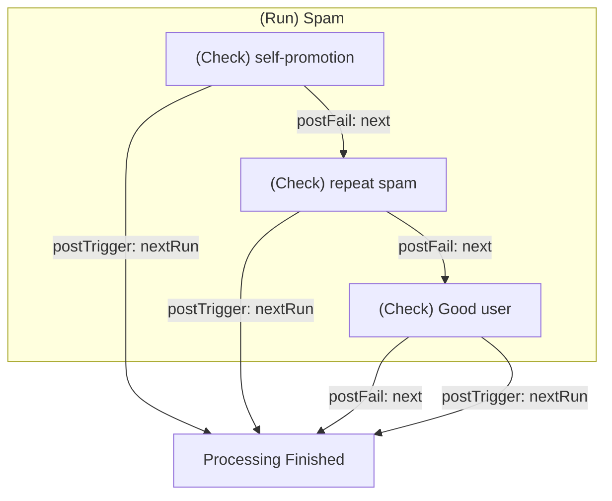
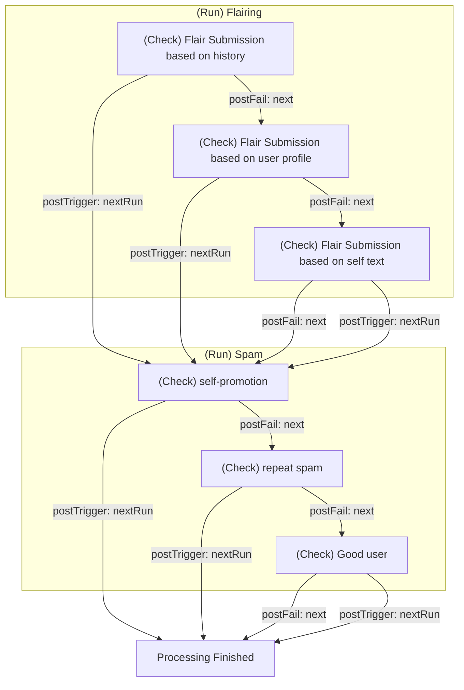

Context Mod's behavior after a **Check** has been processed can be configured by a user. This allows a subreddit to control exactly what Runs/Checks will be processed based on the outcome (triggered or not) of a Check.

# Table of Contents

- [Post-Check Properties](#post-check-properties)
    * [State](#state)
    * [Behavior](#behavior)
        + [Next](#next)
        + [Next Run](#next-run)
        + [Stop](#stop)
        + [Goto](#goto)
            - [Goto Syntax](#goto-syntax)
- [Default Behaviors](#default-behaviors)
    * [Defining Default Behaviors](#defining-default-behaviors)
- [Examples](#examples)

# Post-Check Properties

## State

When a Check is finished processing it can be in one of two states:

* **Triggered** -- The **Rules** defined in the Check were **triggered** which caused the **Actions** for the Check to be run
* **Failure** -- The **Rules** defined in the check were **not triggered**, based on the conditions that were set (either from the [Check condition](/docs/README.md#Checks) or [Rule Sets](/docs/moderators/components/advancedConcepts/README.md#Rule-Sets)), and no **Actions** were run

The behavior CM follows is based on which state it is in. The behavior can be specified **by one or both** of these **state properties** on the Check configuration:

* `postTrigger` -- Specifies what behavior to take when the check is **triggered**
* `postFail` -- Specifies what behavior to take when the check is **not triggered**

## Behavior

There are **four** behaviors CM can take. Both/either **state properties** can be defined with **any behavior.**

### Next

The **Next** behavior tells CM to continue to whatever comes *after the Check that was just processed.* This could be another Check or, if this is the last Check in a Run, the next Run.

NOTE: `next` is the **default behavior** for the `postFail` state

Example

```yaml
- name: MyCheck
  # ...
  postFail: next # if Check is not triggered then CM will start processing AnotherCheck
  
- name: AnotherCheck
  # ...
```

### Next Run

The **Next Run** behavior tells CM to **skip all remaining Checks in the current Run and start processing the next Run in order.**

NOTE: `nextRun` is the **default behavior** for the `postTrigger` state

Example

```yaml
runs:
  - name: MyFirstRun
    checks:
      - name: MyCheck
        # ...
        postTrigger: nextRun # if Check is triggered then CM will SKIP mySecondCheck and instead start processing MySecondRun
      - name: MySecondCheck
        # ...
        
  - name: MySecondRun
    checks:
      - name: FooCheck
        # ...
```

### Stop

The **Stop** behavior tells CM to **stop processing the Activity entirely.** This means all remaining Checks and Runs will not be processed.

Example

```yaml
runs:
  - name: MyFirstRun
    checks:
      - name: MyCheck
        # ...
        postTrigger: stop # if Check is triggered CM will NOT process MySecondCheck OR MySecondRun. The activity is "done" being processed at this point
      - name: MySecondCheck
        # ...
        
  - name: MySecondRun
    checks:
      - name: FooCheck
        # ...
```

### Goto

The **Goto** behavior is an **advanced** behavior that allows you to specify that CM should "jump to" a specific place in your configuration, regardless of order/location, and continue processing the Activity from there. It can be used to do things like:

* create a loop/iteration to have CM re-process the Activity on an earlier executed part of your configuration because a later part modified the Activity (flaired, etc...)
* use a Check as a simplified *switch statement*

**Goto should be use with care.** If you do not fully understand how this mechanism works you should avoid using it as **most** behaviors can be accomplished using the other behaviors. 

As an additional protection **goto depth is limited to 1 by default** which means if a `goto` would be executed more than once during an Activity's lifecycle CM will automatically stop processing that Activity. The `maxGotoDepth` can be raised by the [**Bot Operator**](/docs/operator/gettingStarted.md) per subreddit.

#### Goto Syntax

Location to "jump to" can be specified as:

* **Run** -- `goto:myRunName`
* **Check inside a different Run** -- `goto:myRunName.aCheckInsideTheRun`
* **Check inside the current Run** -- `goto:.myCheck`

Example

```yaml
runs:
  - name: MyFirstRun
    checks:
      - name: FirstCheck
        # ...
      - name: MyCheck
        # ...
        postTrigger: 'goto:MyThirdRun' # jump to the run MyThirdRun
        postFail: 'goto:MySecondRun.BuzzCheck' # jump to the Check BuzzCheck inside the Run MySecondRun
        
  - name: MySecondRun
    checks:
      - name: FooCheck
        # ...
      - name: BuzzCheck
        # ...
        
  - name: MyThirdRun
    checks:
      - name: BarCheck
        # ...
```

# Default Behaviors

It is **not required** to define post-Check behavior. CM uses sane defaults to mimic the behavior of automoderator as well as what is "intuitive" when reading a configuration -- that logic flows from top-to-bottom in the order it was defined. For each Check like this:

```yaml
- name: MyCheck
  kind: comment
  rules: 
   # ...
  actions:
   # ...
```

`postTrigger` and `postFail` have default behaviors (mentioned in the sections above) that make the Check end up working like this:

```yaml
- name: MyCheck
  kind: comment
  rules: 
   # ...
  actions:
   # ...
  postTrigger: nextRun # check is triggered and actions were performed, skip remaining checks and go to the next Run
  postFail: next # check is not triggered and no actions performed, continue to the next check in this Run
```

**So if you are fine with all Checks running in order until one triggered there is no need to define post-Check behaviors at all.**

## Defining Default Behaviors

Defining `postTrigger` and/or `postFail` on a **Run** will set the default behavior for any **Checks** in the Run that **do not have an explicit behavior set.**

```yaml
runs:
  - name: MyFirstRun
    postTrigger: stop # all Checks without postTrigger defined will have 'stop' as their behavior
    checks:
      - name: FooCheck # postTrigger is 'stop' since it is not defined
        # ...
      - name: BarCheck
        # ...
        postTrigger: next # overrides default behavior
```

# Examples

One **Run** with **default behavior** (no post-Check behavior explicitly defined)



Two **Runs** with **default behavior** (no post-Check behavior explicitly defined)


