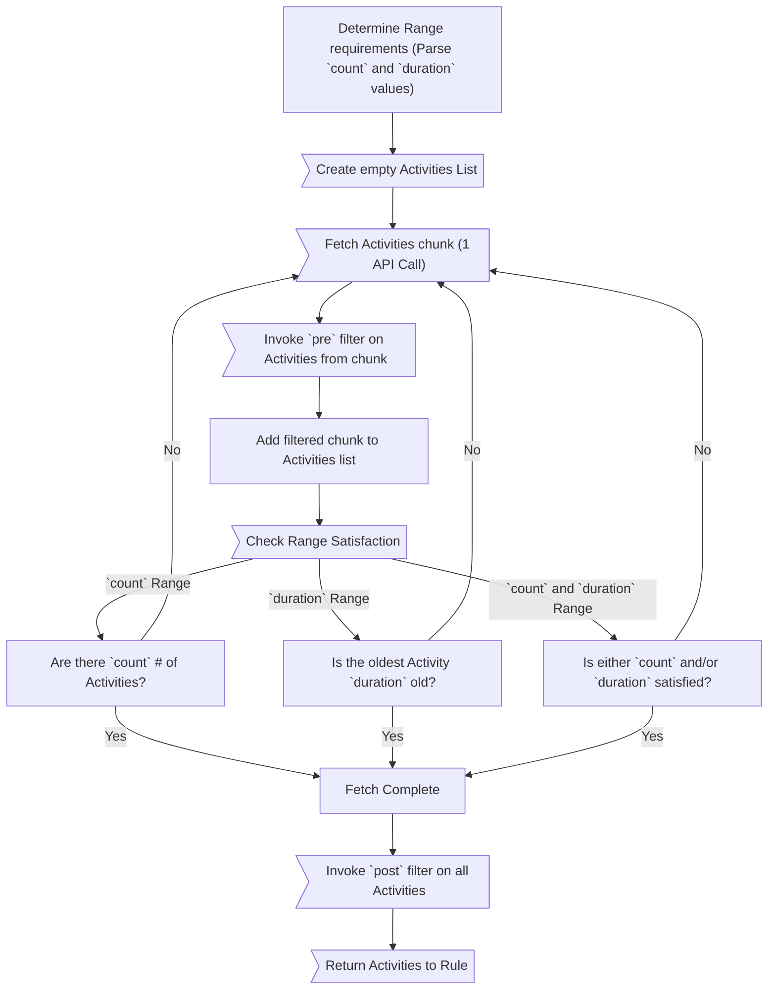

# Table Of Contents

* [Overview](#overview)
  * [Lifecycle](#lifecycle)
* Window Components
  * [Range](#range)
    * [Count](#count)
    * [Duration](#duration)
      * [Duration String](#duration-string-recommended)
      * [Duration Object](#duration-object)
    * [Specifying Range](#specifying-range)
  * [Specifying Activity Type](#types-of-activities)
  * [Filters](#filters)
    * [Properties](#filter-properties)
    * [Lifecycle](#filter-lifecycle)
      * [`pre`](#pre-filter)
      * [`post`](#post-filter)
* [More Examples](#more-examples)
  * [Count](#count-examples)
  * [Duration](#duration-examples)
  * [Count And Duration](#count-and-duration-examples)
  * [Activity Types](#activity-type-examples)
  * [Filter](#filter-examples)

# Overview

An **Activity Window** (`window`) is a group of properties that describe a **range** of [**Activities**](/docs/README.md#activity) to retrieve from Reddit and how to **filter** them.

The main components of an Activity Window:

* **Range** -- How many Activities (count) or what time period (duration) of Activities to fetch
* **Type of Activities** -- When **fetching** from an Author's history, should it return overview (any Activities), just Submissions, or just Comments?
* **Filters** -- How the retrieved Activities should be [filtered](/docs/subreddit/components/README.md#filters) before returning them to a Rule


As an example, if you want to run a **Recent Activity Rule** to check if a user has had activity in /r/mealtimevideos you also need to define what range of activities you want to look at from that user's history.

## Lifecycle

Understanding the lifecycle for how CM uses the Activity Window to retrieve Activities is important to effectively using it.



# Range

There are two types of values that can be used when defining a range:

## Count

This is the **number** of activities you want to retrieve. It's straightforward -- if you want to look at the last 100 activities for a user you can use `100` as the value.

### Shorthand

If **count** is the only property you want to define (leaving everything else as default) then `window` can be defined with just this value:

```yaml
window: 70 # retrieve 70 activities
```
****
Otherwise, use the `count` property on a full `window` object:

```yaml
window:
  count: 70 # retrieve 70 activities
  ...
```

## Duration

A **duration of time** between which all activities will be retrieved. This is a **relative value** that calculates the actual range based on **the duration of time subtracted from when the rule is run.**

For example:

* Today is **July 15th**
* You define a duration of **10 days**

Then the range of activities to be retrieved will be between **July 5th and July 15th** (10 days).

### Shorthand

If a Duration string is the only property you want to define (leaving everything else as default) then `window` can be defined with just this value:

```yaml
window: '9 days' # retrieve last 9 days of activities
```

Otherwise, use the `duration` property on a full `window` object:

```yaml
window:
  duration: '9 days'
  ...
```

### Duration Types

The value used to define the duration can be **one of these two types**:

#### Duration String (recommended)

A string consisting of

* A [Dayjs unit of time](https://day.js.org/docs/en/durations/creating#list-of-all-available-units)
* The value of that unit of time

Examples:

* `9 days`
* `14 hours`
* `80 seconds`

You can ensure your string is valid by testing it [here.](https://regexr.com/61em3)

##### As ISO 8601 duration string

If you're a real nerd you can also use a [standard duration](https://en.wikipedia.org/wiki/ISO_8601#Durations)) string.

Examples

* `PT15M` (15 minutes)

Ensure your string is valid by testing it [here.](https://regexr.com/61em9)

#### Duration Object

If you need to specify multiple units of time for your duration you can instead provide a [Dayjs duration **object**](https://day.js.org/docs/en/durations/creating#list-of-all-available-units) consisting of Dayjs unit-values.

```yaml
window:
  days: 4
  hours: 6
  minutes: 20
```

## Specifying Range

You may use **one or both range properties.**

If both range properties are specified then the value `satisfyOn` determines how the final range is determined


### Using `satisfyOn: any` (default)

If **any** then Activities will be retrieved until one of the range properties is met, **whichever occurs first.**

```yaml
window:
  count: 80
  duration: 90 days
  satisfyOn: any
```
Activities are retrieved in chunks of 100 (or `count`, whichever is smaller)

* If 90 days of activities returns only 40 activities => returns 40 activities
* If 80 activities is only 20 days of range => 80 activities

### Using `satisfyOn: all`

If **all** then both ranges must be satisfied. Effectively, whichever range produces the most Activities will be the one that is used.

```yaml
window:
  count: 100
  duration: 90 days
  satisfyOn: all
```
Activities are retrieved in chunks of 100 (or `count`, whichever is smaller)

* If at 90 days of activities => 40 activities retrieved
  * continue retrieving results until 100 activities
  * so range is >90 days of activities
* If at 100 activities => 20 days of activities retrieved
  * continue retrieving results until 90 days of range
  * so results in >100 activities

# Types of Activities

When retrieving an Author's history the window can specify if it should return all Activities (overview), just Comments, or just Submissions, using the `fetch` property:

```yaml
window:
  # defaults to 'overview'
  fetch: 'submission' # must be one of: overview, comment, submission
```

# Filters

Activity Window can also specify [Item and Subreddit Filters](/docs/subreddit/components/README.md#filters) to filter the Activities retrieved from Reddit before they are returned to a Rule.

Activities can be filtered **during** (`pre`) retrieval or **after** (`post`) retrieval. **When**, during the window **lifecycle**, the Activities are filtered can change the set of Activities returned to a Rule drastically.

## Filter Properties

Regardless of when you are filtering Activities the shape of the filter is the same. Filter properties:

* `subreddits` -- A [Filter Shape](/docs/subreddit/components/README.md#filter-shapes) for filtering by the Subreddit of each Activity
* `submissionState` -- A [Filter Shape](/docs/subreddit/components/README.md#filter-shapes) for [Submission Criteria](/docs/subreddit/components/README.md#item-filter). Will run only if filtering a Submission.
* `commentState` -- A [Filter Shape](/docs/subreddit/components/README.md#filter-shapes) for [Comment Criteria](/docs/subreddit/components/README.md#item-filter). Will run only if filtering a Comment.
* `activityState` -- A [Filter Shape](/docs/subreddit/components/README.md#filter-shapes) for either [Submission or Comment Criteria](/docs/subreddit/components/README.md#item-filter). Will run only if `submissionState` or `commentState` is not defined for their respective Activity types.

Example

In this example the filter only returns Activities:

* With a subreddit that
  * Is from the subreddit /r/mealtimevideos OR
  * Has a name that matches the regex `/ask.*/i` (starts with `ask`) OR
  * Is marked as NSFW
* AND if the Activity is a Submission:
  * must be self text
* AND if the Activity is a Comment (because `activityState` is defined and `commentState` is not):
  * Comment is NOT removed 

```yaml
subreddits:
  include:
    - 'mealtimevideos'
    - '/ask.*/i'
    - over18: true
      
submissionState:
  include:
    - is_self: true

activityState:
  exclude:
    - removed: false
```

## Filter Lifecycle

Filters can be independently specified for two different "locations" during the window lifecycle using the `filterOn` property.

### `pre` Filter

`pre` will filter Activities from **each API call, before** they are added to the full list of retrieved Activities and, most importantly, **before CM checks if Range conditions have been satisfied.** See the [Lifecycle Diagram](#lifecycle).

This is useful when you want the Range conditions to be applied to an "already filtered" list of Activities -- as opposed to afterwards (like `post`).

#### `max` restriction

However, `pre` introduces the possibility of **unsatisfied range conditions.** 

For example, if you want 200 activities from a subreddit a user has never created activities in then CM would fetch the user's **entire history** before finishing since each chunk of Activities would be filtered to 0.

To prevent this scenario all `pre` filters must also specify a `max` [range](#range) that tell CM "if X range of **non-filtered** Activities is reached stop immediately."

#### `pre` Example

Let's follow an example scenario where you want the last 200 activities a user has in /r/mealtimevideos

```yaml
window:
  count: 200
  filterOn:
    pre:
      subreddits:
        include:
          - mealtimevideos
      max: 400
```

* CM fetches the first chunk of 100 Activities (100 total unfiltered)
  * `pre` Filter finds 70 of those 100 are from /r/mealtimevideos => Total Filtered Activities 70
  * CM Checks range condition => 70 is less than 200
  * CM Checks max condition => 100 unfiltered is less than 400
* CM fetches second chunk of 100 Activities (200 total unfiltered)
  * `pre` Filter finds another 70 of those 100 are from /r/mealtimevideos => Total Filtered Activities 140
  * CM Checks range condition => 140 is less than 200
  * CM Checks max condition => 200 unfiltered is less than 400
* CM fetches third chunk of 100 activities (300 total unfiltered)
  * `pre` Filter finds 90 of those 100 are from /r/mealtimevideos => Total Filtered Activities 230
  * CM checks range condition => 230 is more than 200
  * CM Checks max condition => 300 unfiltered is less than 400

**CM is done fetching activities with 230 Filtered Activities**

Now let's look at the same scenario but `max` is hit:

* CM fetches the first chunk of 100 Activities (100 total unfiltered)
  * `pre` Filter finds 10 of those 100 are from /r/mealtimevideos => Total Filtered Activities 10
  * CM Checks range condition => 10 is less than 200
  * CM Checks max condition => 100 unfiltered is less than 400
* CM fetches second chunk of 100 Activities (200 total unfiltered)
  * `pre` Filter finds another 15 of those 100 are from /r/mealtimevideos => Total Filtered Activities 25
  * CM Checks range condition => 25 is less than 200
  * CM Checks max condition => 200 unfiltered is less than 400
* CM fetches third chunk of 100 activities (300 total unfiltered)
  * `pre` Filter finds 5 of those 100 are from /r/mealtimevideos => Total Filtered Activities 30
  * CM checks range condition => 30 is less than 200
  * CM Checks max condition => 300 unfiltered is less than 400
* CM fetches fourth chunk of 100 activities (400 total unfiltered)
  * `pre` Filter finds 0 of those 100 are from /r/mealtimevideos => Total Filtered Activities 30
  * CM checks range condition => 30 is less than 200
  * CM Checks max condition => 400 unfiltered is NOT less than 400
    * CM stops fetching due to max condition hit

**CM is done fetching activities with 30 Filtered Activities**

### `post` Filter

`post` will filter the full list of Activities **after range conditions are satisfied**. This also means it receives the list of Activities filtered by the [`pre` filter](#pre-filter), if one is defined.

The list returned by `post` is what the Rule receives.

#### Example

Let's follow an example scenario where you want any Activities a user has in /r/mealtimevideos from their last 200 activities -- contrast this wording to the [`pre` example](#pre-example)

```yaml
window:
  count: 200
  filterOn:
    post:
      subreddits:
        include:
          - mealtimevideos
```

* CM fetches the first chunk of 100 Activities (100 total unfiltered)
  * CM checks range condition => 100 is less than 200
* CM fetches the second chunk of 100 Activities (200 total unfiltered)
  * CM checks range condition => 200 is equal to 200
* CM is done fetching activities with 200 unfiltered Activities
  * `post` filter finds 10 of those 200 are from /r/mealtimevideos
  * CM returns 10 Activities to the Rule

# More Examples

### Count Examples

#### Get last 100 activities in a User's history

```yaml
window: 100
```
or

```yaml
window:
  count: 100
```

### Duration Examples

#### Get last 2 weeks of a User's history

```yaml
window: '2 weeks'
```
or

```yaml
window:
  duration: '2 weeks'
```

#### Get last 24 hours and 30 minutes of User's history

```yaml
window:
  duration:
    hours: 24
    minutes: 30
```

### Count and Duration Examples

#### Get EITHER last 6 months or last 200 activities of User's history

Whichever is [satisifed first](#using-satisfyon-any-default)

```yaml
window:
  count: 200
  duration: '6 months'
```

#### Get AT LEAST the last 6 months and last 200 activities of User's history

Both must be [satisifed](#using-satisfyon-all)

```yaml
window:
  count: 200
  duration: '6 months'
  satisfyOn: 'all'
```

### Activity Type Examples

#### Get the last 200 submissions from User's history

```yaml
window:
  count: 200
  fetch: 'submission'
```

#### Get the last 200 comments from User's history

```yaml
window:
  count: 200
  fetch: 'comment'
```

#### Get the last 200 activities (submissions or comments) from User's history

```yaml
window:
  count: 200
  fetch: 'overview' # or do not include 'fetch' at all, this is the default
```

### Filter Examples

#### Get the all activities from NSFW subreddits in the User's last 200 activities

```yaml
window:
  count: 200
  filterOn:
    post:
      subreddits:
        include:
          - over18: true
```

#### Get the all comments from NSFW subreddits where user is OP, in the User's last 200 activities

```yaml
window:
  count: 200
  fetch: 'comment'
  filterOn:
    post:
      subreddits:
        include:
          - over18: true
      commentState:
        include:
          - op: true
```

#### Get the last 200 self-text submissions from a User's history and return any from ask* subreddits

```yaml
window:
  count: 200
  fetch: 'submission'
  filterOn:
    pre:
      submissionState:
        include:
          - is_self: true
      max: 500
    post:
      subreddits:
        include:
          - '/ask.*/i'
```
